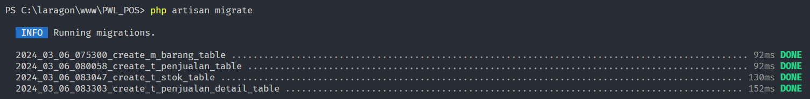
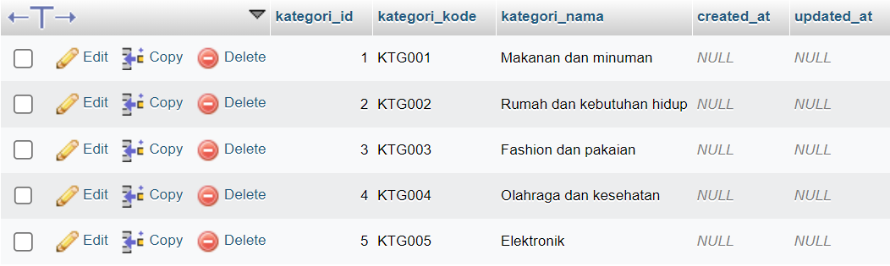

### Doni Wahyu Kurniawan <br> TI-2H | 13 | 2241720015 <hr>
<div align="center">

## JOBSHEET 3 <br> MIGRATION, SEEDER, DB FACADE, QUERY BUILDER, dan ELOQUENT ORM

</div>

## A. PENGATURAN DATABASE
### Praktikum 1
1. Create Database\

2. Configure .env
    ```
    APP_NAME=Laravel
    APP_ENV=local
    APP_KEY=base64:g+xSF6FEo9hj5mOa+WWjJbcFfL4nw56yQ3pOVY8rPMc=
    APP_DEBUG=true
    APP_URL=http://localhost

    LOG_CHANNEL=stack
    LOG_DEPRECATIONS_CHANNEL=null
    LOG_LEVEL=debug

    DB_CONNECTION=mysql
    DB_HOST=127.0.0.1
    DB_PORT=3306
    DB_DATABASE=PWL_POS
    DB_USERNAME=root
    DB_PASSWORD=
    ```
## B. MIGRATION
### Praktikum 2.1
1. create_m_level_table
    ```php
    public function up(): void
    {
        Schema::create('m_level', function (Blueprint $table) {
            $table->id('level_id');
            $table->string('level_kode', 10)->unique();
            $table->string('level_nama', 100);
            $table->timestamps();
        });
    }
    ```
    php artisan migrate\
    \
    result\
    
2. create_m_kategori_table
    ```php
    public function up(): void
    {
        Schema::create('m_kategori', function (Blueprint $table) {
            $table->id('kategori_id');
            $table->string('kategori_kode', 10)->unique();
            $table->string('kategori_nama', 100);
            $table->timestamps();
        });
    }
    ```
    php artisan migrate\
    \
    result\
    
### Praktikum 2.2
1. create m_user_table
    ```php
    Schema::create('m_user', function (Blueprint $table) {
        $table->id('user_id');
        $table->unsignedBigInteger('level_id')->index();
        $table->string('username', 20)->unique();
        $table->string('nama', 100);
        $table->string('password');
        $table->timestamps();

        $table->foreign('level_id')->references('level_id')->on('m_level'); 
    });
    ```
    php artisan migrate\
    \
    result\
    
2. create m_barang
    ```php
    public function up(): void
    {
        Schema::create('m_barang', function (Blueprint $table) {
            $table->id('barang_id');
            $table->unsignedBigInteger('kategori_id')->index();
            $table->string('barang_kode', 10)->unique();
            $table->string('barang_nama', 100);
            $table->integer('harga_beli');
            $table->integer('harga_jual');
            $table->timestamps();

            $table->foreign('kategori_id')->references('kategori_id')->on('m_kategori');
        });
    }
    ```
3. create t_penjualan
    ```php
        public function up(): void
    {
        Schema::create('t_penjualan', function (Blueprint $table) {
            $table->id('penjualan_id');
            $table->unsignedBigInteger('user_id')->index();
            $table->string('pembeli', 50);
            $table->string('penjualan_kode', 20)->unique();
            $table->dateTime('penjualan_tanggal');
            $table->timestamps();

            $table->foreign('user_id')->references('user_id')->on('m_user');
        });
    }
    ```
4. create t_stok
    ```php
    public function up(): void
    {
        Schema::create('t_stok', function (Blueprint $table) {
            $table->id('stok_id');
            $table->unsignedBigInteger('barang_id')->index();
            $table->unsignedBigInteger('user_id')->index();
            $table->dateTime('stok_tanggal');
            $table->integer('stok_jumlah');
            $table->timestamps();

            $table->foreign('barang_id')->references('barang_id')->on('m_barang');
            $table->foreign('user_id')->references('user_id')->on('m_user');
        });
    }
    ```
5. create t_penjualan_detail
    ```php
    public function up(): void
    {
        Schema::create('t_penjualan_detail', function (Blueprint $table) {
            $table->id('detail_id');
            $table->unsignedBigInteger('penjualan_id')->index();
            $table->unsignedBigInteger('barang_id')->index();
            $table->integer('harga');
            $table->integer('jumlah');
            $table->timestamps();

            $table->foreign('penjualan_id')->references('penjualan_id')->on('t_penjualan');
            $table->foreign('barang_id')->references('barang_id')->on('m_barang');
        });
    }
    ```
    php artisan migrate\
    \
    result\
    \
    
## C. SEEDER
### Praktikum 3
1. create seeder file for m_level table
    ```
    php artisan make:seeder LevelSeeder
    ```
2. insert the data
    ```php
    use Illuminate\Support\Facades\DB;

    class LevelSeeder extends Seeder
    {
        public function run(): void
        {
            $data = [
                ['level_id' => 1, 'level_kode' => 'ADM', 'level_nama' => 'Administrator'],
                ['level_id' => 2, 'level_kode' => 'MNG', 'level_nama' => 'Manager'],
                ['level_id' => 3, 'level_kode' => 'STF', 'level_nama' => 'Staff/Kasir'],
            ];
            DB::table('m_level')->insert($data);
        }
    }
    ```
    \
    
3. create seeder file for m_user table that refering to m_level table
    ```
    php artisan make:seeder UserSeeder
    ```
4. modificate UserSeeder class file
    ```php
    use Illuminate\Support\Facades\DB;
    use Illuminate\Support\Facades\Hash;

    class UserSeeder extends Seeder
    {
        public function run(): void
        {
            $data = [
                [
                    'user_id' => 1,
                    'level_id' => 1,
                    'username' => 'admin',
                    'nama' => 'Administrator',
                    'password' => Hash::make('12345'),
                ],
                [
                    'user_id' => 2,
                    'level_id' => 2,
                    'username' => 'manager',
                    'nama' => 'Manager',
                    'password' => Hash::make('12345'),
                ],
                [
                    'user_id' => 3,
                    'level_id' => 3,
                    'username' => 'staff',
                    'nama' => 'Staff/Kasir',
                    'password' => Hash::make('12345'),
                ],
            ];
            DB::table('m_user')->insert($data);
        }
    }
    ```
    
    

5. Insert seeder data for other table
    * m_kategori
        ```php
        public function run(): void
        {
            $data = [
                ['kategori_kode' => 'KTG001', 'kategori_nama' => 'Makanan dan minuman'],
                ['kategori_kode' => 'KTG002', 'kategori_nama' => 'Rumah dan kebutuhan hidup'],
                ['kategori_kode' => 'KTG003', 'kategori_nama' => 'Fashion dan pakaian'],
                ['kategori_kode' => 'KTG004', 'kategori_nama' => 'Olahraga dan kesehatan'],
                ['kategori_kode' => 'KTG005', 'kategori_nama' => 'Elektronik'],
            ];
            DB::table('m_kategori')->insert($data);
        }
        ```
        
    * m_barang
        ```php
        public function run(): void
        {
            $data =[
                [
                    'kategori_id' => 1,
                    'barang_kode' => 'BEV001',
                    'barang_nama' => 'Mie instan',
                    'harga_beli' => 3_000,
                    'harga_jual' => 4_000,
                ],
                [
                    'kategori_id' => 1,
                    'barang_kode' => 'BEV002',
                    'barang_nama' => 'Jus jeruk',
                    'harga_beli' => 10_000,
                    'harga_jual' => 15_000,
                ],
                [
                    'kategori_id' => 2,
                    'barang_kode' => 'HOM001',
                    'barang_nama' => 'Rak buku',
                    'harga_beli' => 200_000,
                    'harga_jual' => 250_000,
                ],
                [
                    'kategori_id' => 2,
                    'barang_kode' => 'HOM002',
                    'barang_nama' => 'Tempat sampah',
                    'harga_beli' => 20_000,
                    'harga_jual' => 25_000,
                ],
                [
                    'kategori_id' => 3,
                    'barang_kode' => 'FAS001',
                    'barang_nama' => 'Kaos polos',
                    'harga_beli' => 30_000,
                    'harga_jual' => 40_000,
                ],
                [
                    'kategori_id' => 3,
                    'barang_kode' => 'FAS002',
                    'barang_nama' => 'Jaket kulit',
                    'harga_beli' => 200_000,
                    'harga_jual' => 250_000,
                ],
                [
                    'kategori_id' => 4,
                    'barang_kode' => 'OLR001',
                    'barang_nama' => 'Pull up bar',
                    'harga_beli' => 110_000,
                    'harga_jual' => 150_000,
                ],
                [
                    'kategori_id' => 4,
                    'barang_kode' => 'OLR002',
                    'barang_nama' => 'Whey protein',
                    'harga_beli' => 100_000,
                    'harga_jual' => 130_000,
                ],
                [
                    'kategori_id' => 5,
                    'barang_kode' => 'ELT001',
                    'barang_nama' => 'Kipas angin',
                    'harga_beli' => 100_000,
                    'harga_jual' => 120_000,
                ],
                [
                    'kategori_id' => 5,
                    'barang_kode' => 'ELT002',
                    'barang_nama' => 'Speaker bluetooth',
                    'harga_beli' => 140_000,
                    'harga_jual' => 170_000,
                ]
            ];
            DB::table('m_barang')->insert($data);
        }
        ```
        
    * t_stok
        ```php
        public function run(): void
        {
            $data = [
                [
                    'barang_id' => 1,
                    'user_id' => 1,
                    'stok_jumlah' => 100,
                    'stok_tanggal' => Carbon::now()
                ],
                [
                    'barang_id' => 2,
                    'user_id' => 2,
                    'stok_jumlah' => 90,
                    'stok_tanggal' => Carbon::now()
                ],
                [
                    'barang_id' => 3,
                    'user_id' => 3,
                    'stok_jumlah' => 110,
                    'stok_tanggal' => Carbon::now()
                ],
                [
                    'barang_id' => 4,
                    'user_id' => 1,
                    'stok_jumlah' => 200,
                    'stok_tanggal' => Carbon::now()
                ],
                [
                    'barang_id' => 5,
                    'user_id' => 2,
                    'stok_jumlah' => 300,
                    'stok_tanggal' => Carbon::now()
                ],
                [
                    'barang_id' => 6,
                    'user_id' => 3,
                    'stok_jumlah' => 60,
                    'stok_tanggal' => Carbon::now()
                ],
                [
                    'barang_id' => 7,
                    'user_id' => 1,
                    'stok_jumlah' => 99,
                    'stok_tanggal' => Carbon::now()
                ],
                [
                    'barang_id' => 8,
                    'user_id' => 2,
                    'stok_jumlah' => 76,
                    'stok_tanggal' => Carbon::now()
                ],
                [
                    'barang_id' => 9,
                    'user_id' => 3,
                    'stok_jumlah' => 80,
                    'stok_tanggal' => Carbon::now()
                ],
                [
                    'barang_id' => 10,
                    'user_id' => 1,
                    'stok_jumlah' => 344,
                    'stok_tanggal' => Carbon::now()
                ],
            ];
            DB::table('t_stok')->insert($data);
        }
        ```
        
    * t_penjualan
        ```php  
        public function run(): void
        {
            $data = [];
            $userIds = [1, 2, 3];
            $pembelis = ['Doni', 'Wahyu', 'Kurniawan', 'Wayak', 'Yan', 'Cha', 'Putri', 'Nad', 'Daffa', 'Ihza'];
            $penjualanKodes = ['PJL001', 'PJL002', 'PJL003', 'PJL004', 'PJL005', 'PJL006', 'PJL007', 'PJL008', 'PJL009', 'PJL010'];
            $penjualanTanggal = Carbon::now();

            foreach ($userIds as $index => $userId) {
                $data[] = [
                    'user_id' => $userId,
                    'pembeli' => $pembelis[$index],
                    'penjualan_kode' => $penjualanKodes[$index],
                    'penjualan_tanggal' => $penjualanTanggal
                ];
            }

            DB::table('t_penjualan')->insert($data);
        }
        ```
        
    * t_penjualan_detail
        ```php
        public function run(): void
        {
            $penjualanIds = DB::table('t_penjualan')->pluck('penjualan_id')->toArray();
            $barangIds = DB::table('m_barang')->pluck('barang_id')->toArray();

            $data = [];
            $count = 0;

            for ($i = 0; $i < 2; $i++) {
                foreach ($penjualanIds as $penjualanId) {
                    $randomBarangIds = array_rand($barangIds, 3);

                    foreach ($randomBarangIds as $randomBarangId) {
                        $barangId = $barangIds[$randomBarangId];
                        $hargaJual = DB::table('m_barang')->where('barang_id', $barangId)->value('harga_jual');
                        $jumlah = rand(1, 10);

                        $data[] = [
                            'barang_id' => $barangId,
                            'penjualan_id' => $penjualanId,
                            'harga' => $hargaJual * $jumlah,
                            'jumlah' => $jumlah,
                        ];

                        $count++;
                        if ($count >= 30) {
                            break 3;
                        }
                    }
                }
            }

            DB::table('t_penjualan_detail')->insert($data);
        }
        ```
        
## D. DB FACADE
### Praktikum 4
1. create LevelController
    ```
    php artisan make:controller LevelController
    ```
2. route modification
    ```php
    Route::get('/level', [LevelController::class, 'index']);
    ```
3. insert data via DB Facade
    ```php
    DB::insert('insert into m_level(level_kode, level_nama, created_at) values(?, ?, ?)', ['CUS', 'Pelanggan', now()]);
    return 'Insert data baru berhasil';
    ```
    \
    
4. update data via DB Facade
    ```php
    $row = DB::update('update m_level set level_nama = ? where level_kode = ?', ['Customer', 'CUS']);;
    return 'Update data berhasil. Jumlah data yang diupdate: ' . $row . ' baris';
    ```
    \
    
5. Delete data via DB Facade
    ```php
    $row = DB::delete('delete from m_level where level_kode = ?', ['CUS']);
    return 'Delete data berhasil. Jumlah data yang dihapus: ' . $row . ' baris';
    ```
    \
    
6. Select data via DB Facade
    ```php
    $data = DB::select('select * from m_level');
    return view('level', ['data' => $data]);
    ```
    ```html
    <!DOCTYPE html>
    <head>
        <title>Data Level Pengguna</title>
    </head>
    <body>
        <h1>Data Level Pengguna</h1>
        <table border="1" cellpadding="2" cellspacing="0">
            <tr>
                <th>TD</th>
                <th>Kode Level</th>
                <th>Nama Level</th>
            </tr>
            @foreach ($data as $d)
            <tr>
                <td>{{ $d->level_id}}</td>
                <td>{{ $d->level_kode}}</td>
                <td>{{ $d->level_nama}}</td>
            </tr>
            @endforeach
        </table>
    </body>
    </html>
    ```
    
## E. QUERY BUILDER
### Praktikum 5
1. create KategoriController
    ```
    php artisan make:controller KategoriController
    ```
2. Insert data via query builder
    ```php
    $data = [
        'kategori_kode' => 'SNK',
        'kategori_nama' => 'Snack/Makanan Ringan',
        'created_at' => now(),
    ];
    DB::table('m_kategori')->insert($data);
    return 'Insert data baru berhasil';
    ```
    
    
3. Update data via query builder
    ```php
    $row = DB::table('m_kategori')->where('kategori_kode', 'SNK')->update(['kategori_nama' => 'Camilan']);
    return 'Update data berhasil. Jumlah data yang diupdate: ' . $row . ' baris';   
    ```
    
    
3. Delete data via query builder
    ```php
    $row = DB::table('m_kategori')->where('kategori_kode', 'SNK')->delete();
    return 'Delete data berhasil. Jumlah data yang dihapus: ' . $row . ' baris';
    ```
    
    
4. Read data via query builder
    ```php
    $data = DB::table('m_kategori')->get();
    return view('kategori', ['data' => $data]);
    ```
    
